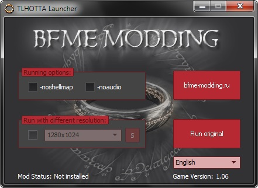

# TLHOTTA (The Last Hope of the Third Age) Launcher

This is a source code of launcher program, written in Delphi.

Binaries of AlphaControls 2015 v10.14 (27.07.2015) built in Delphi XE included.
To make them work, copy `acntDelphiXE_R.bpl` to `%WINDIR%\SysWOW64` and then install `acntDelphiXE.bpl` as Delphi package.

If you don't like XE binaries, get AlphaControls (https://alphaskins.com) and build your own.

Copyright (c) Str1ker, 2013-2015. All rights reserved.

"TLHOTTA" and "The Last Hope of the Third Age" are private properties of https://bfme-modding.ru
